# App Description

## Home page
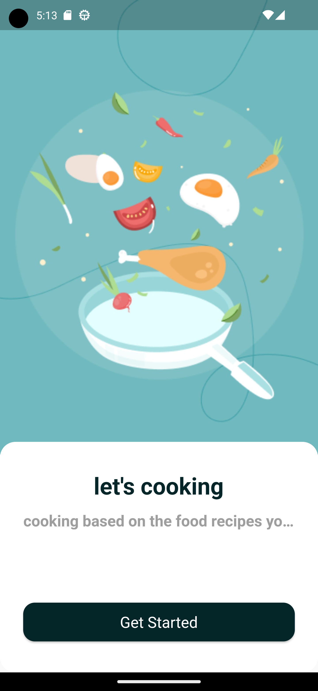

## Login page , hide password 
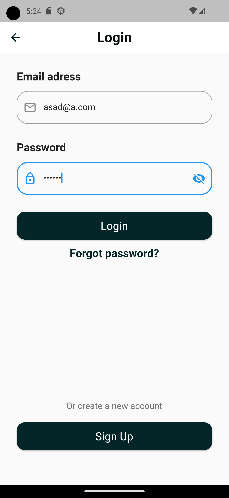
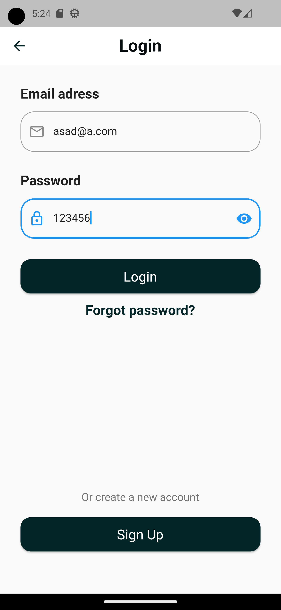

## Creat account page , hide password 
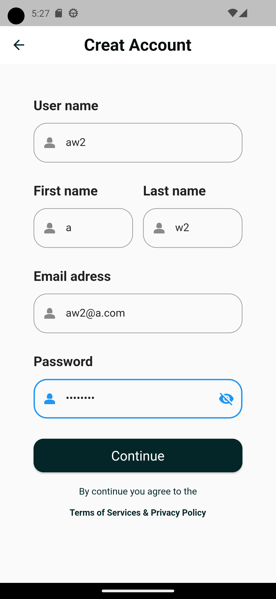
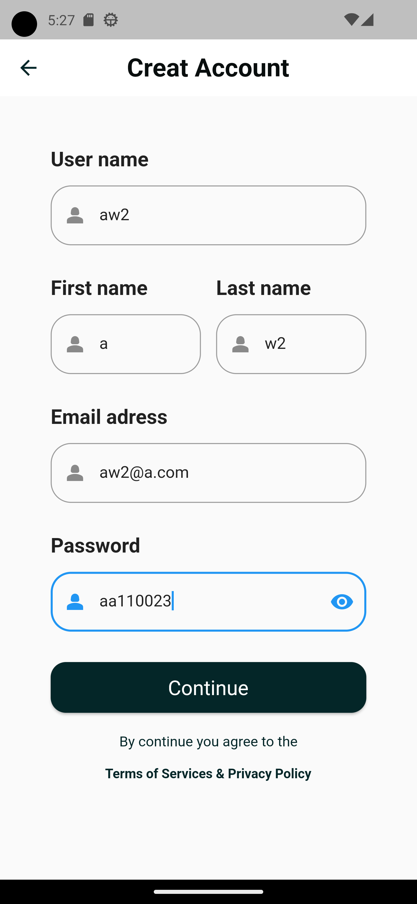

## Seaarch page 
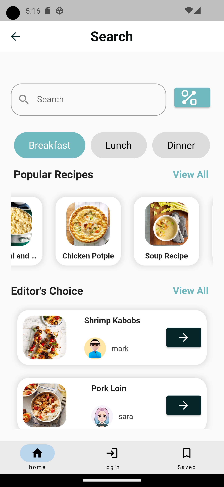

## when user click on "Lunch" OR "Dinner" , the content of food will change. Both menus are scroller
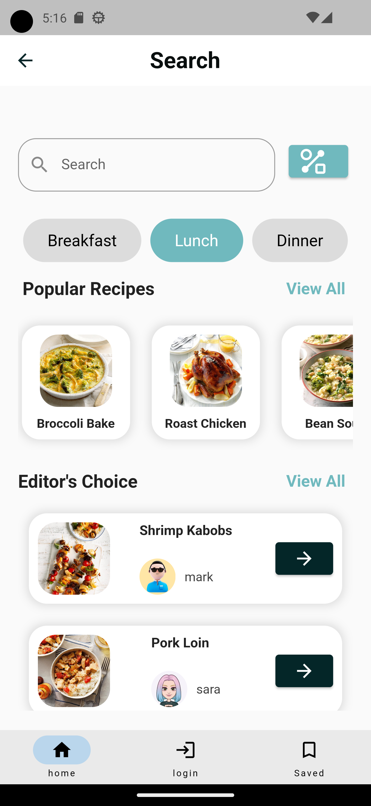
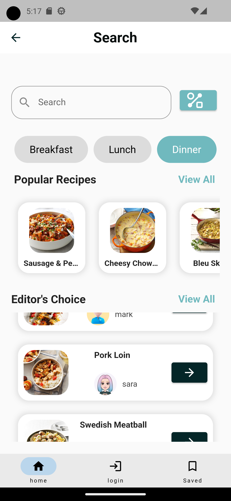

## Filter page , can click many button , and it will still pressed 
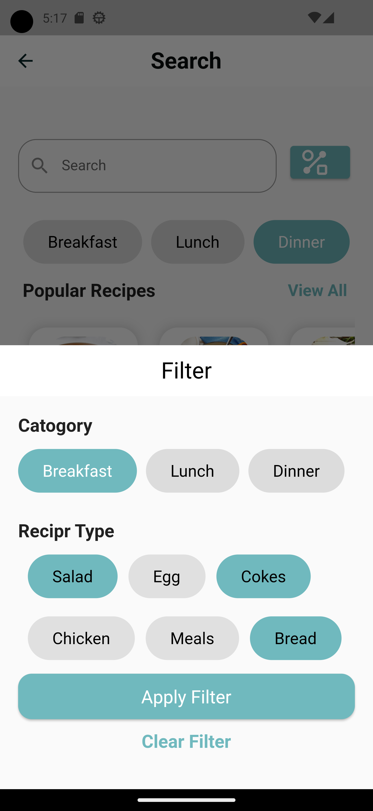

## when press on "Clear filter " it will makes buttons unpressed  
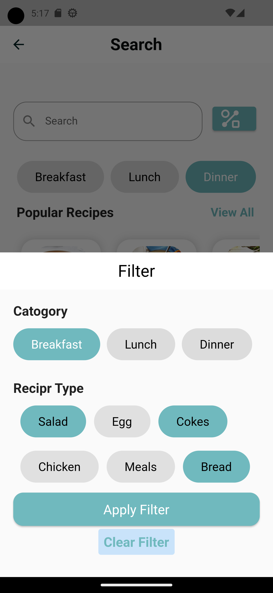
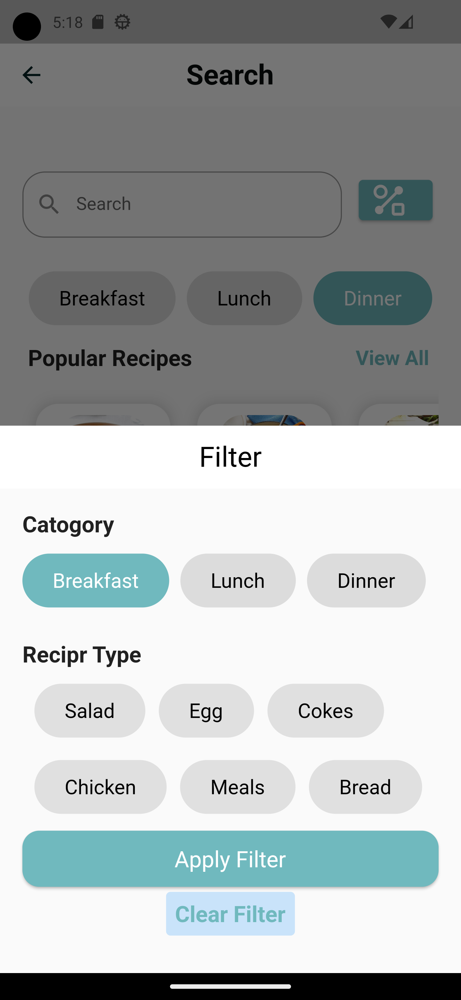

## when click on "View All" as showin , it will display all food in the menue
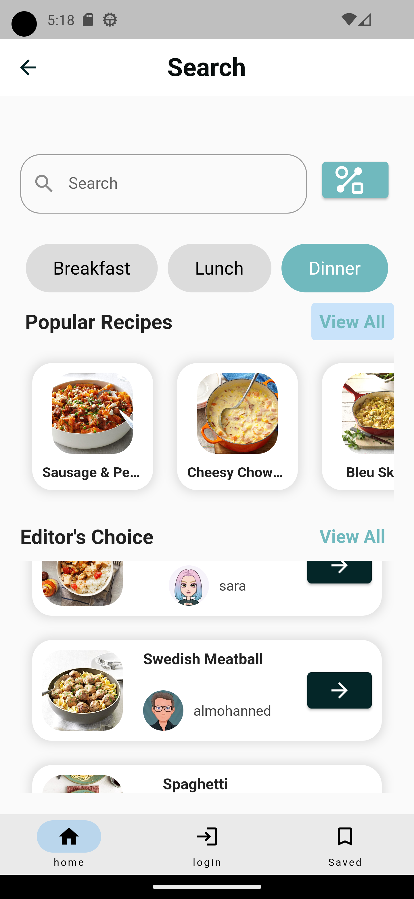
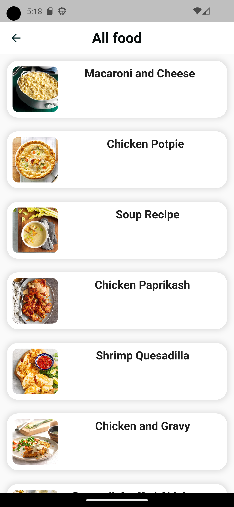

