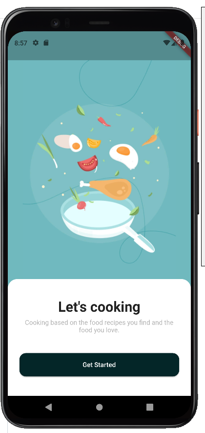
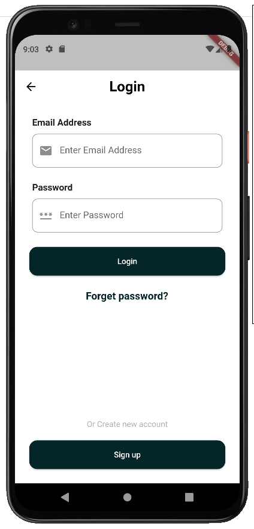
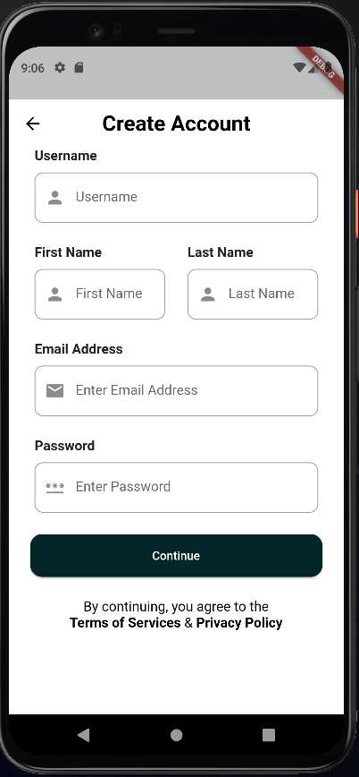
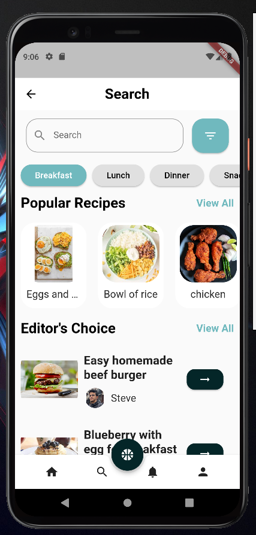
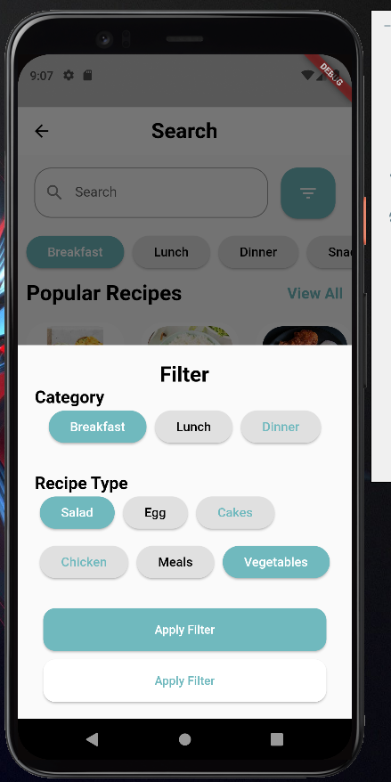

# Cooking Helper Application 

## General details
1. The designs requested were Implemented.
2. The following are some of the widgets that were used:
   - Image
   - AppBar
   - TextField
   - Row
   - Column
   - Icon
   - Button
   - SingleChildScrollView
3. The application provides navigation between pages.
  
  ## Pages:
  ### Welcom page
  
 This is the initial page the user faces when fisrt opening the application. 

  

  ### Login page
   
 This is page where the user is asked to either provide their credentials and login or sign up 

   

   ### Sign up page
   
 In this page the user is requested to input some information in order to create a new account/ sign up

   

   ### Search screen
   
 This is the search page, where the user can explor recipes through couple of ways inculding:

   <ul>
        <li>Search bar </li>
        <li>Filter</li>
        <li>Popualr recipes section (scrollable)</li>
        <li>Editor's choice section (scrollable)</li>
   </ul>
   

   ### Filter fragment
   
 This fragment will appear to the user when they want to use the filter:

   

   ### Bouns features 
   
unfortunately no bouns features were implemented

