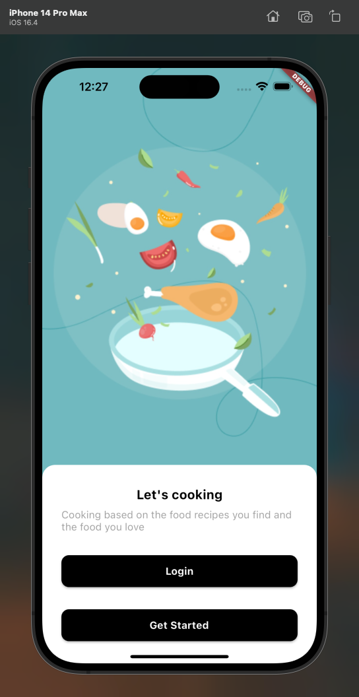
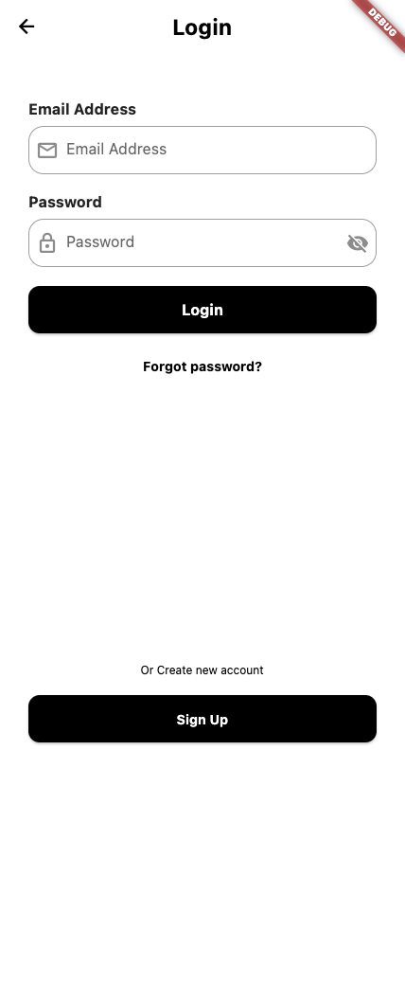
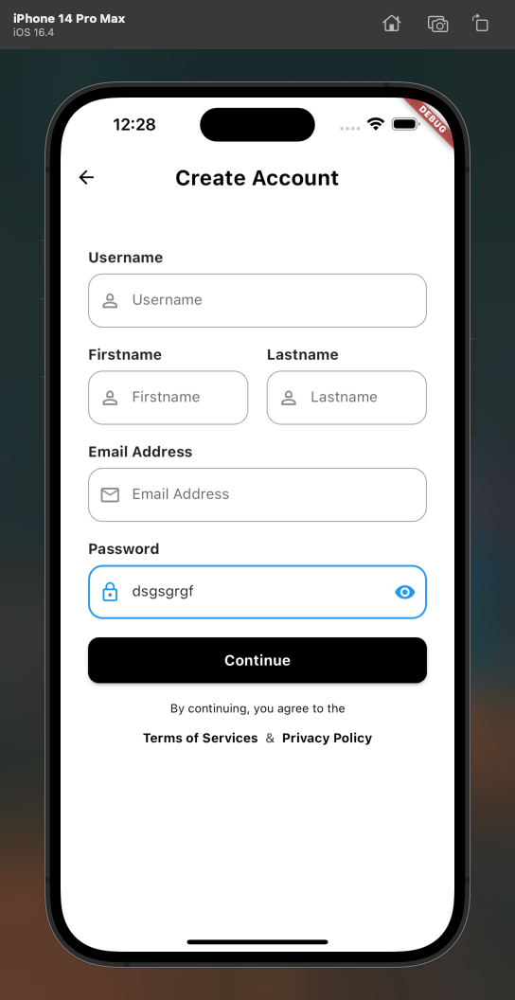
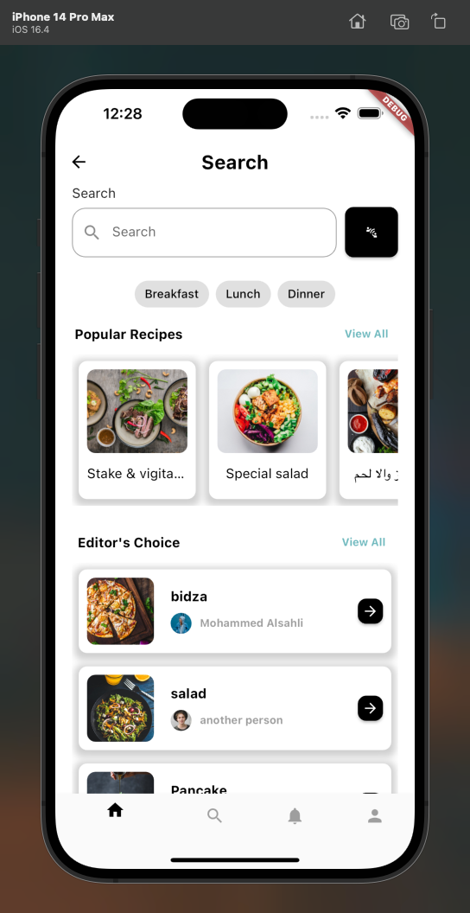
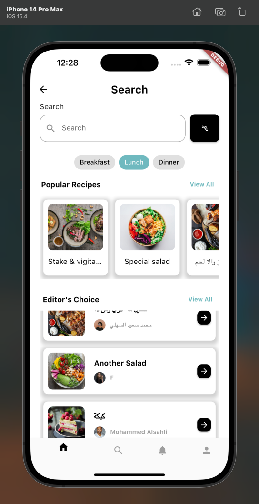
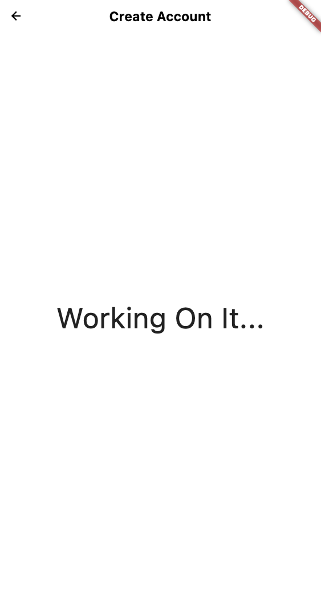

# in this read me file I will talk about the app

### main page

#### this is the page that will be at first of open the app

### login page

#### this is the login page

### create account page

#### this is the create account page

### search page

#### this is the search page

### filter page

#### this is the filter page

### working on it page

#### this is the working on it page

