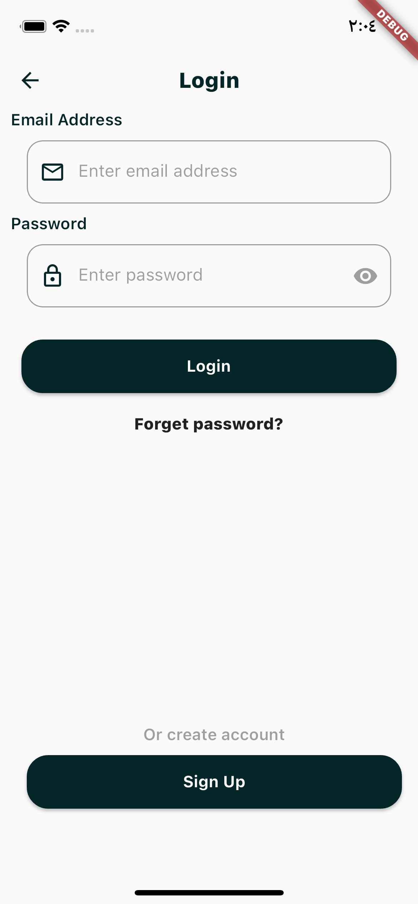

# HW-1

**Implement this design in an app using Flutter.**
  
## App Screens:

**This is a landing page**
  
**This is a page for login**
  
**This is a page for signup**
  
**This is a Home page**
  
**This is a window for allow the filter option**
  

